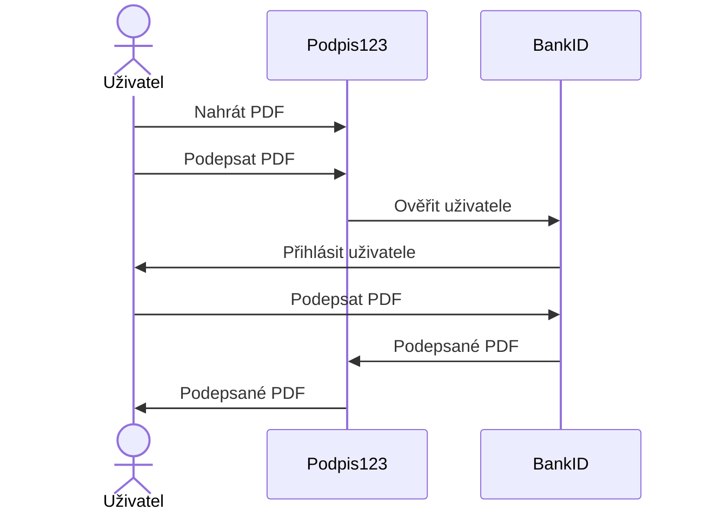

# Podpisovací webový porál



## Správa

### Git

```
git clone https://github.com/podpis123/podpis123.git
```

### Ansible

Natavení virtuálního stroje, kde běží aplikace

### Nginx

Webový server

### Email

Hosting u active24

### Backup

rsync

## Programování

### API

### Správa souborů
* [How to serve private media files with Django](https://dev.to/joshwizzy/how-to-serve-private-media-files-with-django-41e0)
* [Nginx x-accel explained](https://blog.horejsek.com/nginx-x-accel-explained/)
* [Nginx resources](https://www.nginx.com/resources/wiki/start/topics/examples/xsendfile/)

### Django
* [Django project documentation](https://docs.djangoproject.com/en/4.1/)

## Podepisování

### BankID
* [Developerský portál](https://developer.bankid.cz/)
* [Github oficiální příklady](https://github.com/BankovniIdentita/BankID-examples/tree/master/curl)

### WebCrypto API
* [Developer Mozilla Documentation](https://developer.mozilla.org/en-US/docs/Web/API/Web_Crypto_API)

## Dokumentace

### API

### Nápověda

### Kontakt
